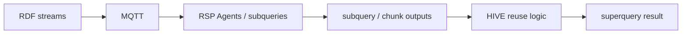

# HIVE / Streaming Query Hive

Streaming Query Hive (HIVE) is a research prototype for RDF stream processing. It studies query-result reuse for RSP-QL workloads where multiple queries consume the same streams but use overlapping or mismatched windows.

**TL;DR**

HIVE asks when a streaming query system can reuse already-computed results instead of re-evaluating each query from raw RDF streams.
The hard case is mismatched windows: the queries are related, but their window ranges or slides do not align exactly.
The repository compares three strategies: `fetching`, `approximation`, and `chunked` reuse / reconstruction.
This is a trade-off study, not a claim that reuse is always faster than fetching.

## Quick Start

```bash
npm install
npm run build
mosquitto -d
node scripts/benchmark/run-all-paper-benchmarks.js --suite patterns --smoke --iterations 1
```

Results are written under `results/paper-benchmarks/<timestamp>/` for the unified paper runner, and under the experiment-specific `logs/` directories for the lower-level scripts.

## What HIVE Studies

If each RSP-QL query is evaluated independently, the same stream data and intermediate computation can be repeated many times. This becomes especially wasteful when queries differ only by window size, slide, or related subquery structure.

HIVE focuses on reuse when exact query reuse is not enough:

1. `fetching`: evaluate or fetch the needed raw stream data directly.
2. `approximation`: reuse available query results even when windows do not align exactly, accepting accuracy loss.
3. `chunked`: materialize reusable chunk states and reconstruct larger or mismatched superquery windows from those chunks.

The branch is centered on query-result reuse under mismatched windows, not on exact query reuse alone. Exact reuse is useful context, but it is not the core novelty.

For compatible queries, HIVE uses query containment and query isomorphism to detect reuse opportunities, registers RSP-QL subqueries as reusable producers, and communicates intermediate or final results over MQTT topics. Superqueries then consume those topic streams instead of always starting a fresh end-to-end evaluation.

This repository is experimental research software. The current branch, `chunk-state-reuse-design`, contains active work on chunk-state reuse and reconstruction. The right interpretation is a systems trade-off study over latency, resource usage, communication overhead, and accuracy.

## Research Contribution

The main contribution of this branch is the chunked reuse path:

1. Decompose compatible windowed aggregations into reusable chunk states.
2. Reconstruct superquery results from chunk coverage when window boundaries do not match exactly.
3. Measure when this reduces repeated computation, and when the added coordination cost outweighs the benefit.

In practical terms, the codebase asks:

1. When can an existing RSP-QL subquery result be reused directly?
2. When is approximate reuse acceptable but inaccurate?
3. When can chunk states preserve exactness for compatible decomposable aggregations while supporting mismatched windows?

## System Model

HIVE assumes RDF streams are replayed over MQTT and processed by RSP-QL components.

The main roles are:

| Role | Meaning in this repository |
| --- | --- |
| RSP Agent / subquery | A registered RSP-QL query that evaluates a stream or sub-window and publishes results to an MQTT topic. |
| Superquery | A higher-level query whose result may be derived from multiple subquery outputs, approximated from prior outputs, or reconstructed from chunk states. |
| MQTT topic | The result channel used to publish raw stream events, subquery results, chunk states, and reconstructed outputs. |
| Query containment | Used to detect whether one query can contribute to another query. |
| Query isomorphism | Used to detect equivalence up to structural renaming or normalization. |

Compact architecture:

1. Stream replayers publish RDF observations to MQTT topics.
2. RSP-QL agents subscribe to those topics and produce subquery outputs.
3. HIVE consumes those outputs or chunk-state topics.
4. A superquery path either fetches directly, approximates from prior results, or reconstructs exact results from reusable chunks when supported.
5. Results and diagnostics are written to CSV and JSON artifacts for later analysis.



The current implementation uses `mqtt://localhost:1883` throughout much of the code and benchmark infrastructure. The benchmark runner accepts a broker flag, but non-default brokers are not fully supported yet.

## Reuse Modes Compared

### 1. Fetching baseline

`fetching` evaluates the needed stream data directly for the target query. In the experiments, this is the reference point for correctness and is commonly used as the ground truth for error calculations.

### 2. Approximation

`approximation` reuses already-available query outputs even when the source windows and target windows do not align exactly. This can reduce computation or waiting time, but it can also introduce error. The benchmark suite reports that error explicitly instead of treating approximation as an exact method.

### 3. Chunked reuse / chunked reconstruction

`chunked` materializes chunk-level states that can be recomposed into larger windows. For compatible queries and decomposable aggregations, this allows a superquery to reconstruct its output from reusable chunk states instead of re-reading the full raw stream window.

This branch is specifically concerned with mismatched windows. The key question is whether chunk-level reuse can recover exact or near-exact superquery outputs while avoiding some repeated computation.

## Supported Reuse Assumptions

The chunked path is designed around compatible query classes rather than arbitrary query reuse.

At a high level, reuse is safest when queries share:

1. The same source stream or source-topic identity.
2. Compatible graph pattern and filter semantics.
3. The same aggregated value variable.
4. Compatible time semantics and window boundary assumptions.
5. A decomposable aggregation.

The codebase currently exposes aggregation support for:

- `AVG`
- `SUM`
- `COUNT`
- `MIN`
- `MAX`

The benchmark runner defaults to `AVG`. If you are reproducing a paper artifact, verify the aggregation choice in the runner metadata before comparing results across branches or versions.

For chunked reconstruction, these matter because exact reuse may require chunk state rather than only final chunk-local outputs. For example, exact `AVG` reconstruction requires reusable `sum` and `count`, not only an average-of-averages.

## Repository Layout

The most important directories for reviewers and benchmark users are:

| Path | Purpose |
| --- | --- |
| `src/` | Core TypeScript implementation of agents, orchestrators, operators, reuse logic, and profiling. |
| `src/approaches/` | The approach-specific orchestrators: fetching, approximation, chunked, naive distributed, and scalability variants. |
| `src/services/operators/` | Runtime operators, including chunked aggregation and approximation logic. |
| `src/reuse/` | Query normalization and reuse-registry code. |
| `src/util/` | Runtime configuration, profiling, topic naming, resource tracing, and parser helpers. |
| `experiments/real-data-comparison/` | Four-approach benchmark over real accelerometer streams. |
| `experiments/pattern-analysis/` | Custom-pattern experiments used for controlled evaluation of behavior under different signal shapes. |
| `experiments/k-scaling/` | Reuse-density / scalability benchmark for increasing numbers of compatible consumers. |
| `scripts/benchmark/` | Top-level paper benchmark runners and extraction scripts. |
| `analysis/` | Post-processing and visualization scripts. |
| `docs/` | Design notes, experiment reports, and branch-specific decisions. |
| `images/` | Architecture figure used in the documentation. |

Useful branch-specific design notes:

- `docs/chunk-state-primary-reuse-design.md`
- `docs/decisions/`

## Installation

### Prerequisites

The repository expects:

1. Node.js 20.x or a close equivalent.
2. An MQTT broker, typically Mosquitto.
3. A sibling checkout of `RSP-JS`, because `package.json` depends on `file:../RSP-JS`.

Example setup:

```bash
git clone <repo-url> streaming-query-hive
git clone <rsp-js-repo-url> ../RSP-JS
cd streaming-query-hive
npm install
npm run build
```

Start the MQTT broker:

```bash
mosquitto -d
```

On macOS with Homebrew:

```bash
brew install mosquitto
brew services start mosquitto
```

Verify the main input datasets exist:

```bash
ls src/streamer/data/smartphone.acceleration.x/data.nt
ls src/streamer/data/wearable.acceleration.x/data.nt
```

If custom pattern data is missing, regenerate it:

```bash
node scripts/generate-custom-patterns.js
```

## Linting and Tests

Lint TypeScript:

```bash
npm run lint:ts
```

Auto-fix lint issues where possible:

```bash
npm run lint:ts:fix
```

Run the Jest test suite:

```bash
npm test
```

## Quick Smoke Test

The fastest end-to-end benchmark smoke test in the current paper runner is:

```bash
node scripts/benchmark/run-all-paper-benchmarks.js \
  --suite patterns \
  --smoke \
  --iterations 1
```

This exercises the custom-pattern pipeline with a reduced matrix and writes a self-contained snapshot under:

```text
results/paper-benchmarks/smoke-<timestamp>/
```

For a quick real-data run of all four implemented approaches:

```bash
node experiments/real-data-comparison/run-real-data-4-approaches.js --iterations 1
```

## Running the Paper Benchmarks

The paper-oriented entry point is:

```bash
node scripts/benchmark/run-all-paper-benchmarks.js --suite all
```

Important flags:

```bash
node scripts/benchmark/run-all-paper-benchmarks.js --help
```

Common examples:

Run only the real-data suite:

```bash
node scripts/benchmark/run-all-paper-benchmarks.js --suite real-data
```

Run only the custom-pattern suite:

```bash
node scripts/benchmark/run-all-paper-benchmarks.js --suite patterns
```

Run a targeted pattern subset:

```bash
node scripts/benchmark/run-all-paper-benchmarks.js \
  --suite patterns \
  --patterns high_freq_oscillation \
  --approaches fetching,approximation,chunked \
  --iterations 1
```

Skip post-analysis for debugging:

```bash
node scripts/benchmark/run-all-paper-benchmarks.js \
  --suite patterns \
  --approaches approximation,chunked \
  --iterations 1 \
  --skip-analysis
```

The current default paper configuration in the runner is:

| Parameter | Default |
| --- | --- |
| MQTT broker | `mqtt://localhost:1883` |
| Output window | `120000 ms` |
| Output slide | `60000 ms` |
| Sub-window range | `60000 ms` |
| Sub-window step | `30000 ms` |
| Replay frequency | `4 Hz` |
| Aggregation | `AVG` |
| Iterations | `35` |
| Trimmed summary | drop first `3`, drop last `2` |

## Reproducing the Experiments

For reproduction, the repository currently has three benchmark layers that matter most.

### A. Real-data comparison

This benchmark compares the implemented approaches on replayed accelerometer streams:

```bash
node experiments/real-data-comparison/run-real-data-4-approaches.js --iterations 35
```

Primary output location:

```text
experiments/real-data-comparison/logs/
```

Summary artifacts:

```text
experiments/real-data-comparison/logs/real_data_comparison_results.csv
experiments/real-data-comparison/logs/real_data_comparison_results.json
```

### B. Custom-pattern comparison

This benchmark evaluates controlled patterns such as low variability, step behavior, spikes, and oscillations:

```bash
node experiments/pattern-analysis/run-custom-patterns-comparison.js --iterations 35
```

Primary output location:

```text
logs/custom-pattern-comparison/
```

The runner currently targets these five main pattern families:

- `low_variability`
- `step_pattern`
- `spike_pattern`
- `low_freq_oscillation`
- `high_freq_oscillation`

### C. Same-query / different-window scalability

This benchmark varies the number of compatible consumers and tracks how reuse overhead scales:

```bash
node scripts/benchmark/run-scalability-benchmarks.js \
  --scenario same_query_different_windows \
  --scales 2,4,6,8,10 \
  --approaches fetching,naive_distributed,approximation,chunked \
  --iterations 1 \
  --pattern low_variability \
  --replay-duration 210s
```

Primary output location:

```text
logs/scalability/same_query_different_windows/
```

### Unified paper snapshot

If reproducibility for review matters more than raw local logs, prefer the unified paper runner because it copies benchmark outputs into one timestamped directory:

```text
results/paper-benchmarks/<timestamp>/
```

This snapshot typically includes:

- `metadata.json`
- `summary.json`
- `real-data/raw/`
- `patterns/raw/`
- `latency/`
- `resources/`
- `accuracy/`
- `logs/`

## Important Metrics

The benchmark code and extraction scripts report several metrics that are central to the reuse study.

| Metric | Meaning |
| --- | --- |
| `cpu_seconds` | Total CPU time consumed by the benchmarked process tree or extracted run. |
| `peak_rss_mb` / peak RSS | Peak resident memory usage in MB. |
| `window_adjusted_latency_ms` | Latency normalized to the windowing context in the scalability analysis. |
| `ready_to_emit_ms` | Time between semantic readiness of a result and actual emission. Useful for understanding scheduling or synchronization overhead. |
| `computation_ms` | Processing time spent computing or reconstructing a window result after the relevant input boundary is reached. |
| `mean_error` | Average error against the fetching baseline in comparison outputs that compute accuracy. |
| `chunk_state_messages_published` | Number of chunk-state messages emitted by the chunked reuse path. |
| `shared_chunk_producers_created` | Number of reusable chunk producers instantiated. Important for checking whether chunk production is actually shared. |
| `fallback_original_agent_rsps_started` | Number of original-agent RSP executions started because reuse was not possible or was bypassed. |
| `reconstructed_superquery_results` | Number of superquery outputs produced through chunk-based reconstruction. |

Additional diagnostic counters are written through the profiling layer in `src/util/profiling.ts`, including message counts, cache hits, query rewrites, and reconstruction-path counters.

## How to Read the Results

### 1. Do not compare only latency

Chunked reuse can reduce repeated work in some scenarios, but it also introduces chunk production, chunk buffering, MQTT traffic, and synchronization overhead. A lower or higher latency number alone is not enough to justify a conclusion.

### 2. Use fetching as the correctness reference

For most accuracy-oriented analyses in this repository, `fetching` is the baseline. Approximation and chunked outputs should be interpreted relative to that baseline unless a script documents a different reference explicitly.

### 3. Separate exactness from efficiency

Approximation is expected to trade correctness for reuse convenience. Chunked reconstruction is more interesting when it preserves exactness for compatible queries, but exactness still does not imply better overall performance once communication and coordination costs are counted.

### 4. Check reconstruction behavior explicitly

For chunked runs, inspect whether:

1. `shared_chunk_producers_created` stays low and stable.
2. `fallback_original_agent_rsps_started` remains zero or low when reuse was expected.
3. `reconstructed_superquery_results` grows as expected.
4. `chunk_state_messages_published` remains reasonable relative to the number of consumers and windows.

### 5. Read the artifact types by purpose

Common artifact types include:

| Artifact | Typical use |
| --- | --- |
| `*_results.csv` | Window-level outputs for accuracy comparison and result inspection. |
| `*_latency_log.csv` | Timing and emission behavior per window. |
| `*_resource_usage.csv` or `resource_usage.csv` | CPU and memory sampling over time. |
| `mqtt_traffic_summary.json` | Communication overhead summary. |
| `hive_profile_summary.*.json` | Per-process counters and timings from the profiling layer. |
| `summary.json` / `metadata.json` | Run-level configuration, status, and aggregated metadata. |

## MQTT, RSP Agents, and Topic Flow

MQTT topics are not incidental in this repository. They are the transport layer for:

1. Replayed RDF stream events.
2. RSP Agent subquery outputs.
3. Chunk-state publications.
4. Reconstructed superquery outputs.

In other words, the experiments measure not only computational reuse, but also the systems cost of realizing that reuse through a topic-based streaming architecture.

## Research Status and Limitations

This repository should be read as an experimental platform.

Current limitations include:

1. Chunk management and MQTT synchronization can introduce substantial overhead.
2. Reuse is not claimed to always be faster than fetching.
3. The chunked path is safest for compatible decomposable aggregations and compatible query classes; it is not a general-purpose solution for arbitrary RSP-QL workloads.
4. Much of the benchmark infrastructure still assumes `mqtt://localhost:1883`.
5. The `chunk-state-reuse-design` branch contains active design and implementation work; interfaces, metrics, and benchmark scripts may still evolve.
6. Some paper-oriented suites are snapshot views over underlying benchmark runs rather than fully independent benchmark implementations.

The intended interpretation is therefore:

1. HIVE is a trade-off study of reuse under mismatched windows.
2. Fetching remains the baseline for correctness and an important baseline for system cost.
3. Approximation and chunked reuse should be evaluated by the joint behavior of latency, resource use, communication overhead, and error.

## Development Notes

Useful documentation beyond this README:

- `scripts/benchmark/README.md`
- `experiments/README.md`
- `experiments/k-scaling/README.md`
- `docs/SERVER_EXPERIMENT_GUIDE.md`
- `docs/chunk-state-primary-reuse-design.md`

Architecture figure:


## License

This repository is released under the MIT-style license in [LICENCE.md](./LICENCE.md).

## Contact

Questions and issues are best handled through the repository issue tracker.

Direct contact currently listed in the repository:

- Kush Bisen: <mailto:mailkushbisen@gmail.com>
