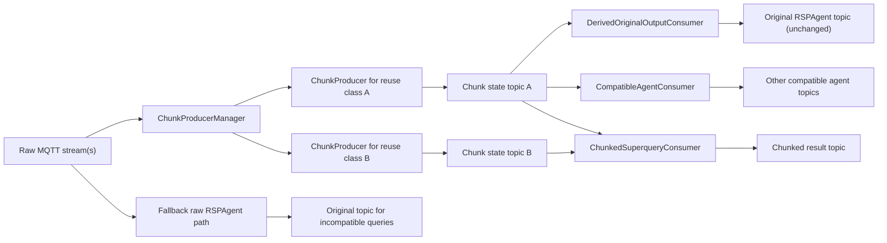

# Chunk State Primary Reuse Design

## Goal

Replace "shared ingestion only" with "shared chunk state as the primary reusable computation" for exact, compatible decomposable aggregations.

For compatible queries, the system should compute chunk partials once and derive all of the following from the same chunk state stream:

1. the original reusable RSPAgent output topic
2. the Chunked superquery output
3. other compatible agent outputs

This document is design-only. It does not propose benchmark parameter changes, sampling changes, or any Approximation, Naive, or Fetching behavior changes.

## Short answer

Yes, one shared chunk producer can compute enough exact partial state to reconstruct both the original RSPAgent output and the Chunked superquery output for:

- `SUM` from `sum`
- `COUNT` from `count`
- `AVG` from `sum + count`
- `MIN` from `min`
- `MAX` from `max`

This is feasible if and only if the reused queries are in the same exact reuse class: same source stream, same pre-aggregation graph/filter semantics, same aggregated value variable, compatible time semantics, compatible chunk boundaries, and a supported decomposable aggregation.

The key architectural change is to make chunk-state production the reusable primitive and make the original reusable RSPAgent output a derived consumer of chunk state rather than a separate raw-event RSP engine.

## Why the current design is still expensive

The current Chunked path can still execute three expensive layers:

1. the original reusable `RSPAgent` query over raw events
2. the rewritten chunk query in `RSPQueryProcess`
3. the Chunked reconstruction in `StreamingQueryChunkAggregatorOperator`

That means shared ingestion alone does not eliminate duplicate query evaluation. It only avoids some duplicate raw stream publication or registration work. The expensive part, repeated RSP evaluation over raw events, still exists.

## Current codebase observations

### Existing behavior

- [`src/agent/RSPAgent.ts`](/Users/kushbisen/Code/streaming-query-hive/src/agent/RSPAgent.ts) always creates a raw-event `RSPEngine`, subscribes to source MQTT streams, and publishes the query result to the registered `r2s_topic`.
- [`src/orchestrator/Orchestrator.ts`](/Users/kushbisen/Code/streaming-query-hive/src/orchestrator/Orchestrator.ts) creates `RSPAgent` instances for subqueries immediately.
- [`src/services/operators/StreamingQueryChunkAggregatorOperator.ts`](/Users/kushbisen/Code/streaming-query-hive/src/services/operators/StreamingQueryChunkAggregatorOperator.ts) separately computes a chunk plan, rewrites subqueries to the GCD chunk, starts `RSPQueryProcess` workers, subscribes to chunk topics, and recomposes exact results from chunk partials when possible.
- [`src/rsp/RSPQueryProcess.ts`](/Users/kushbisen/Code/streaming-query-hive/src/rsp/RSPQueryProcess.ts) already emits structured chunk messages that include `count`, `sum`, `avg`, `value`, and window bounds.
- [`src/util/chunkTypes.ts`](/Users/kushbisen/Code/streaming-query-hive/src/util/chunkTypes.ts) already defines a partial chunk payload shape, but it is query-instance-centric instead of reuse-class-centric.
- [`src/services/HiveQueryBee.ts`](/Users/kushbisen/Code/streaming-query-hive/src/services/HiveQueryBee.ts) and [`src/services/BeeWorker.ts`](/Users/kushbisen/Code/streaming-query-hive/src/services/BeeWorker.ts) currently model Chunked as a separate worker pipeline, not as the primary reusable execution layer.
- Profiling and resource logging are split across [`src/util/profiling.ts`](/Users/kushbisen/Code/streaming-query-hive/src/util/profiling.ts), [`src/util/resourceTrace.ts`](/Users/kushbisen/Code/streaming-query-hive/src/util/resourceTrace.ts), and orchestrator-local CSV samplers such as [`src/approaches/StreamingQueryChunkedApproachOrchestrator.ts`](/Users/kushbisen/Code/streaming-query-hive/src/approaches/StreamingQueryChunkedApproachOrchestrator.ts).

### Important consequence

The code already demonstrates that exact recomposition from chunk partials is viable for `SUM`, `COUNT`, `AVG`, `MIN`, and `MAX`. The missing part is planner-level reuse control so that compatible original outputs stop creating separate raw RSP engines.

## Target architecture

### High-level model

Introduce a shared `ChunkProducer` per reuse class and make both original reusable outputs and Chunked superquery outputs consume the same chunk state stream.



### New architectural roles

#### `ChunkProducerManager`

- owns the registry of active reusable chunk producers
- computes compatibility and reuse-class keys
- deduplicates producer creation
- registers chunk consumers for original-output derivation and Chunked reconstruction

#### `ChunkProducer`

- one exact producer per reuse class
- consumes raw stream events once
- evaluates one exact chunk query at `chunkRange == chunkSlide`
- publishes reusable chunk-state messages

#### `DerivedOriginalOutputConsumer`

- subscribes to the chunk-state topic for a compatible reuse class
- maintains only enough rolling chunk state for the original query window
- derives exact original-window outputs
- publishes to the original `RSPAgent` result topic exactly as before

#### `ChunkedSuperqueryConsumer`

- subscribes to one or more chunk-state topics
- performs the current Chunked recomposition over shared chunk state
- publishes Chunked superquery results

#### `FallbackRawRSPAgent`

- unchanged path for incompatible queries
- preserves current semantics when reuse is not safe

## Reuse class definition

A query can use shared chunk state only if all of the following are identical or explicitly compatible:

1. same source stream or source-topic identity
2. same canonical RDF graph pattern hash
3. same selected aggregated value variable
4. same pre-aggregation filter semantics
5. same aggregation state signature
6. same chunk range
7. same chunk slide
8. same timestamp and watermark policy
9. same window-boundary semantics
10. same multiplicity semantics for matching solution mappings

Queries must also avoid unsupported operators:

- no unsafe post-aggregation `FILTER` or `HAVING`
- no joins unless explicitly proven safe and implemented
- no non-decomposable aggregation
- no query shape that changes row multiplicity after the reusable chunk boundary

### Proposed reuse class key

```text
reuseClassKey =
  sourceStreamId
  + canonicalGraphPatternHash
  + selectedValueVariable
  + filterSignature
  + aggregationStateSignature
  + chunkRange
  + chunkSlide
  + timestampWatermarkPolicy
```

### Notes on key fields

- `canonicalGraphPatternHash` must normalize variable renaming and triple order, but must preserve semantics.
- `filterSignature` must include all filters that apply before aggregation, including datatype coercions if they affect membership.
- `aggregationStateSignature` should represent the required exact state, not just the final aggregation label.
  - `SUM` => `sum`
  - `COUNT` => `count`
  - `AVG` => `sum,count`
  - `MIN` => `min`
  - `MAX` => `max`
  - future `VARIANCE`/`STDDEV` => `sum,count,sumSquares`
- `timestampWatermarkPolicy` must cover benchmark timestamp remapping, contamination rejection, and any late-data policy.

## Supported exact aggregation states

| Aggregation | Exact chunk state needed | Exact recomposition rule |
| --- | --- | --- |
| `SUM` | `sum` | parent `SUM = sum(sum_i)` |
| `COUNT` | `count` | parent `COUNT = sum(count_i)` |
| `AVG` | `sum + count` | parent `AVG = sum(sum_i) / sum(count_i)` |
| `MIN` | `min` | parent `MIN = min(min_i)` |
| `MAX` | `max` | parent `MAX = max(max_i)` |

### Feasibility by aggregation

#### `SUM`

Exact if each chunk represents the exact sum of the same filtered multiset of values over a non-overlapping chunk interval.

Required state:

- `sum`

#### `COUNT`

Exact if each chunk represents the exact count of the same filtered multiset over a non-overlapping chunk interval.

Required state:

- `count`

#### `AVG`

Exact only if the producer publishes both `sum` and `count`.

Required state:

- `sum`
- `count`

Not sufficient:

- chunk-local `avg` alone

Reason:

- averaging averages is incorrect unless weighted by exact counts

#### `MIN`

Exact if each chunk publishes the exact minimum over the same filtered multiset and chunk intervals are complete and non-overlapping.

Required state:

- `min`

#### `MAX`

Exact if each chunk publishes the exact maximum over the same filtered multiset and chunk intervals are complete and non-overlapping.

Required state:

- `max`

## Chunk state schema

The current `PartialChunkResult` is close, but the primary-reuse design needs a stable exact-state schema that is consumer-agnostic and keyed by reuse class rather than by one rewritten query instance.

### Proposed schema

```ts
type ChunkStateMessage = {
  schemaVersion: 1;
  reuseClassKey: string;
  chunkProducerId: string;
  sourceStreamId: string;
  sourceTopic: string;
  aggregationFunction: "AVG" | "SUM" | "COUNT" | "MIN" | "MAX";
  aggregationStateSignature: string;
  valueVariable: string;
  graphPatternHash: string;
  filterSignature: string;
  timestampPolicy: string;
  watermarkPolicy: string;
  chunk: {
    chunkId: string;
    start: number;
    end: number;
    range: number;
    slide: number;
    semantics: "[start,end)";
    sequenceNumber?: number;
  };
  state: {
    count?: number;
    sum?: number;
    min?: number;
    max?: number;
    sumSquares?: number;
  };
  diagnostics?: {
    producerQueryHash: string;
    benchmarkEventTimeAnchor?: number | null;
    rawWindowOpen?: number;
    rawWindowClose?: number;
    contaminatedTimestampRejects?: number;
    duplicateSuppressionKey?: string;
    sourceMessageCount?: number;
  };
};
```

### Minimum exact-state payload by aggregation

- `SUM` producer must fill `state.sum`
- `COUNT` producer must fill `state.count`
- `AVG` producer must fill `state.sum` and `state.count`
- `MIN` producer must fill `state.min`
- `MAX` producer must fill `state.max`

### Why the current payload is insufficient as the long-term primary format

The current structured chunk payload in `RSPQueryProcess` is good enough for a prototype but not yet a robust shared-state contract because:

1. it is keyed by `queryId` and `subqueryId`, not by reuse class
2. `MIN` and `MAX` currently rely on a generic `value` field rather than explicit `min` and `max`
3. producer metadata is not rich enough for deterministic compatibility checks or diagnostics
4. there is no first-class producer identity or deduplication key
5. topic derivation is tied to rewritten-query hashes rather than stable reusable state identity

## Exact derivation of original RSPAgent outputs

### Design

For a compatible query, do not start a separate raw-event `RSPEngine`.

Instead:

1. classify the query into a reuse class
2. obtain or create the shared `ChunkProducer`
3. create a `DerivedOriginalOutputConsumer`
4. subscribe that consumer to the chunk-state topic
5. keep a rolling chunk buffer for that query's exact output window
6. derive the exact output from chunk state
7. publish to the original `r2s_topic`

### Window derivation logic

For an original query window `[Wstart, Wend)`:

- identify all chunk messages whose chunk intervals exactly partition `[Wstart, Wend)`
- require complete contiguous chunk coverage
- reject emission if any chunk is missing or duplicated
- aggregate chunk states according to the exact recomposition rule

### Publication compatibility

The derived path must preserve:

1. the original output topic name
2. output timing semantics as closely as current chunk readiness allows
3. output payload contract for downstream consumers

Recommendation:

- centralize result serialization into a shared publisher helper used by both raw `RSPAgent` and derived-output consumers
- preserve current RDF result shape for original-agent topics
- keep benchmark `RESULT_TOPIC` behavior unchanged

### When this works

This is safe for single-stream exact aggregations and also for multi-source outputs only if they can be rewritten into a deterministic union of compatible chunk streams with no semantic loss.

### What disappears

For compatible reusable queries:

- the separate original raw-event `RSPAgent` `RSPEngine`
- its MQTT subscription clients
- its per-event parsing and insertion work

## Exact derivation of Chunked superquery outputs

The existing Chunked aggregator already demonstrates the central recomposition logic.

### Refined role

`StreamingQueryChunkAggregatorOperator` should evolve from:

- "spawn rewritten subqueries and consume their outputs"

to:

- "register as a consumer of already-managed shared chunk producers"

### Exact behavior

For each output window:

1. determine the required chunk intervals
2. collect exactly one chunk-state message per reuse class per interval
3. verify contiguous full coverage
4. recompose exact result from state
5. publish current Chunked result output

### Important simplification

Once chunk producers are shared and primary:

- the operator should not be responsible for rewriting and starting the chunk queries itself
- it should request compatible chunk streams from the `ChunkProducerManager`

## Fallback behavior

If a query is incompatible with chunk-state derivation:

1. do not register it as chunk-reusable
2. do not attempt derived-output publication
3. run the existing raw `RSPAgent` / `RSPQueryProcess` path
4. profile it as fallback

### Required fallback labels

- `compatible_queries_detected`
- `incompatible_queries_fallback`
- `original_agent_rsps_skipped`
- `fallback_original_agent_rsps_started`

## Compatibility rules in detail

### Must match exactly

- source stream/topic
- pre-aggregation RDF graph pattern
- selected aggregated value variable
- filter semantics before aggregation
- timestamp mapping and contamination policy
- chunk boundaries
- aggregation state signature

### Must be explicitly supported

- union across multiple compatible producers
- any join semantics
- any grouping semantics beyond the current single aggregate output

### Must fall back

- query uses `HAVING` or post-aggregation filtering that depends on the final aggregate value
- query introduces a join that changes multiplicity before aggregation
- query uses unsupported non-decomposable operations
- query window cannot be exactly tiled by the chosen chunk size
- query expects timestamp semantics different from the producer

## Semantic risks

### `AVG` exactness

Risk:

- using only chunk averages is wrong

Mitigation:

- require exact `sum + count` in chunk state
- never derive parent average from `avg` alone

### `MIN` / `MAX` exactness

Risk:

- only safe if chunk minima or maxima are exact over the same filtered event set

Mitigation:

- producer publishes explicit `min` or `max`
- chunk coverage must be contiguous and complete

### `COUNT` semantics

Risk:

- count can be wrong if graph-pattern multiplicity differs across supposedly "same" queries

Mitigation:

- compatibility key must include canonical graph pattern and multiplicity-sensitive filter semantics
- joins remain fallback until proven safe

### Overlapping windows

Risk:

- original windows overlap, but chunk intervals must not overlap for recomposition

Mitigation:

- producer windows must be fixed non-overlapping chunks
- consumers may build overlapping parent windows from those chunk atoms

### Late or missing chunks

Risk:

- emitting before all required chunks arrive produces incomplete exact results

Mitigation:

- exact mode waits for full chunk coverage
- define watermark or lateness policy in the reuse class
- if the implementation later supports late updates, they must be exact corrections, not approximations

### Duplicate chunk contributions

Risk:

- duplicate MQTT deliveries can double-count

Mitigation:

- every chunk message needs a stable `chunkId`
- consumers deduplicate by `(reuseClassKey, chunkId)`

### Filters before aggregation

Risk:

- two queries that differ only by an upstream filter are not reusable

Mitigation:

- filter signature is part of the reuse key

### Topic compatibility

Risk:

- even if the numeric result is exact, payload shape drift can break downstream consumers

Mitigation:

- preserve original topic names
- centralize output serialization
- test raw and derived payload equivalence

### Diagnostics compatibility

Risk:

- current diagnostics are split between raw-agent logs and chunked logs

Mitigation:

- add derivation-specific counters without removing existing resource sampling

## Code impact by file

### [`src/agent/RSPAgent.ts`](/Users/kushbisen/Code/streaming-query-hive/src/agent/RSPAgent.ts)

Change from "always raw query engine" to "planner-controlled raw or derived mode".

Likely changes:

- extract query classification and registration logic out of the constructor path
- add a compatibility check before `new RSPEngine(query)`
- if compatible, skip raw `RSPEngine` creation and instead attach a `DerivedOriginalOutputConsumer`
- preserve `registerToQueryRegistry()` behavior for original topics, but extend the registry payload with reuse metadata if needed
- centralize output publication so raw and derived paths emit the same contract

### [`src/approaches/StreamingQueryChunkedApproachOrchestrator.ts`](/Users/kushbisen/Code/streaming-query-hive/src/approaches/StreamingQueryChunkedApproachOrchestrator.ts)

Change from "declare subqueries and let Chunked create its own private chunk path" to "declare required compatible consumers and let shared producers serve them".

Likely changes:

- stop implicitly assuming `addSubQuery()` should start a raw `RSPAgent`
- register chunk-consumer intent with a manager
- keep benchmark parameters unchanged
- keep the existing resource CSV sampler unchanged

### [`src/services/operators/StreamingQueryChunkAggregatorOperator.ts`](/Users/kushbisen/Code/streaming-query-hive/src/services/operators/StreamingQueryChunkAggregatorOperator.ts)

This file changes the most.

Likely changes:

- stop owning chunk query rewrite/startup as its primary responsibility
- consume a normalized `ChunkStateMessage` contract
- request chunk streams from `ChunkProducerManager`
- retain exact recomposition logic for `SUM`, `COUNT`, `AVG`, `MIN`, `MAX`
- add chunk-consumer registration, deduplication, and compatibility instrumentation
- possibly split into:
  - `ChunkedSuperqueryConsumer`
  - shared exact-state recomposition utilities

The existing exact recomposition helpers are reusable and should remain the semantic core.

### [`src/rsp/RSPQueryProcess.ts`](/Users/kushbisen/Code/streaming-query-hive/src/rsp/RSPQueryProcess.ts)

Refactor from "rewritten subquery worker for Chunked only" into "exact shared chunk-state producer".

Likely changes:

- emit explicit `min` and `max` fields instead of generic `value` only
- emit reuse-class metadata
- publish to a stable chunk-state topic derived from the reuse class key
- support deduplicated producer identity
- keep timestamp extraction and contamination checks
- keep exact chunk boundary extraction

### [`src/services/HiveQueryBee.ts`](/Users/kushbisen/Code/streaming-query-hive/src/services/HiveQueryBee.ts)

Likely changes:

- add worker roles for:
  - shared chunk producer
  - derived original-output consumer
  - chunked superquery consumer
- avoid one bee per rewritten private subquery when a producer already exists

### [`src/services/BeeWorker.ts`](/Users/kushbisen/Code/streaming-query-hive/src/services/BeeWorker.ts)

Likely changes:

- replace containment-only selection with compatibility-class planning
- mediate between query registration and chunk producer reuse
- route compatible queries to derived-output consumers
- route incompatible queries to fallback raw execution
- keep Approximation operator routing unchanged

### Profiling and resource code

Files:

- [`src/util/profiling.ts`](/Users/kushbisen/Code/streaming-query-hive/src/util/profiling.ts)
- [`src/util/resourceTrace.ts`](/Users/kushbisen/Code/streaming-query-hive/src/util/resourceTrace.ts)
- orchestrator-local CSV samplers such as [`src/approaches/StreamingQueryChunkedApproachOrchestrator.ts`](/Users/kushbisen/Code/streaming-query-hive/src/approaches/StreamingQueryChunkedApproachOrchestrator.ts)

Required change:

- add counters, do not remove or soften existing resource sampling
- keep CPU and RSS measurement cadence the same
- keep benchmark samplers in place so savings are attributable to fewer processes and engines, not to lighter sampling

### Benchmark scripts

No benchmark parameter changes should be required.

Possible script changes later:

- expose the new counters in artifact summaries
- annotate when results came from derived original outputs vs fallback raw outputs

Do not change:

- window sizes
- step sizes
- replay duration
- resource sampling interval
- benchmark result topics

## Topic design

### Current state

- original reusable query topics are published directly by `RSPAgent`
- rewritten chunk queries publish to ad hoc topics such as `chunked/<sessionId>/<hash>`

### Proposed state

- original result topics remain unchanged
- chunk-state topics become stable and reuse-class-based

Example:

```text
chunk_state/<reuseClassKey>
```

or, if session isolation is still required for benchmarks:

```text
chunk_state/<sessionId>/<reuseClassKey>
```

The important part is that topic identity must map to reusable semantics, not just a rewritten-query hash.

## Result publication design

Recommendation:

- extract a shared result-publication helper for:
  - original raw `RSPAgent` outputs
  - derived original outputs
  - chunked superquery outputs

This avoids payload drift and makes topic compatibility testable.

## Tests needed

### Unit tests

- compatibility classifier:
  - same source + same filter + same value variable => compatible
  - different filter => incompatible
  - same aggregation label but different state signature => incompatible
- chunk-state recomposition:
  - `SUM`
  - `COUNT`
  - `AVG` with weighted recomposition
  - `MIN`
  - `MAX`
- duplicate chunk suppression
- missing chunk detection
- topic serializer equivalence for raw vs derived original outputs

### Integration tests

- one compatible original query derives exact results from chunk state without starting a raw `RSPAgent` engine
- one incompatible query falls back to raw `RSPAgent`
- one shared producer serves:
  - original output topic
  - chunked superquery output
  - second compatible consumer
- mixed compatible and incompatible queries in the same run

### Regression tests

- Approximation path unchanged
- Naive path unchanged
- Fetching path unchanged
- benchmark output schema unchanged
- resource sampler files still present and structurally unchanged

## Validation benchmark plan

Do not run yet.

### Phase 1: one-query correctness validation

- pattern: `low_variability`
- aggregation: `AVG`
- windows: 3

Goal:

- prove exact equality between raw original output and chunk-derived original output for a single compatible case

### Phase 2: targeted two-pattern validation against Fetching

- compare chunk-derived outputs against Fetching as the correctness oracle
- use two patterns that stress both stable and boundary-sensitive behavior

Goal:

- prove exactness across supported aggregations and window overlap conditions

### Phase 3: K-scaling after correctness is proven

- only run scaling after:
  - correctness is proven
  - fallback accounting is visible
  - resource reduction is measurable

Goal:

- show process, RSPEngine, MQTT, and RSS reduction versus shared-ingestion-only Chunked

## Required profile counters

Add these counters to `src/util/profiling.ts` usage sites:

- `shared_chunk_producers_created`
- `chunk_state_messages_published`
- `original_agent_outputs_derived_from_chunks`
- `original_agent_rsps_skipped`
- `fallback_original_agent_rsps_started`
- `chunk_consumers_registered`
- `compatible_queries_detected`
- `incompatible_queries_fallback`
- `duplicate_chunk_producer_attempts_prevented`
- `rsp_engines_created`
- `mqtt_clients_created`
- `cpu_seconds`
- `peak_rss_mb`

### Notes

- `rsp_engines_created` should become the primary proof that the raw reusable path is disappearing for compatible queries.
- `cpu_seconds` and `peak_rss_mb` should be derived in analysis from existing process-level traces or added without changing sampling cadence.
- keep existing counters such as `mqtt_messages_received`, `mqtt_messages_published`, `reconstructed_superquery_results`, and `emitted_results`.

## Expected resource impact

### Processes that should disappear

For compatible original reusable queries:

- separate raw-event `RSPAgent` engines for those queries

Depending on implementation:

- some private rewritten-subquery workers may also disappear if chunk producers are managed centrally instead of per-Chunked request

### RSPEngines that should disappear

- raw `RSPEngine` instances for compatible original reusable queries

Remaining:

- one exact `RSPEngine` per shared chunk producer reuse class

### MQTT messages that should disappear

- original raw reusable result publications that were only needed because the raw query ran separately
- some duplicated intermediate chunk topics if multiple Chunked consumers currently cause equivalent rewritten queries

Remaining:

- one chunk-state publication per chunk producer per chunk
- one derived original-output publication per original topic
- one Chunked result publication per output window

### Memory structures that remain

- rolling chunk buffers for active consumers
- deduplication sets keyed by chunk id
- query compatibility registry
- existing benchmark samplers and profiling maps

### Why this should reduce CPU and RSS more than shared ingestion only

Because it removes repeated query evaluation over raw events.

Shared ingestion only still leaves:

- raw-event parsing into multiple `RSPEngine` instances
- multiple per-event stream insertions
- multiple window-maintenance data structures

Chunk-state-primary reuse collapses those costs into:

- one producer evaluation over raw events
- lightweight rolling recomposition over compact chunk summaries

That should reduce:

- per-event CPU
- per-engine heap/state retention
- MQTT client count
- duplicate raw-stream subscription overhead

## Open questions

1. Should compatible original outputs be derived in-process with the producer or via separate consumer workers?
2. Should the registry at `http://localhost:8080/register` store compatibility metadata or remain topic-only?
3. Do we need byte-for-byte output compatibility for original topics, or only RDF-semantic equivalence?
4. Are multi-stream union queries promoted to first-class reusable consumers now, or left as Chunked-only consumers initially?
5. Should chunk-state topics be session-scoped for benchmarks and global in non-benchmark mode?

## Recommended implementation order

1. Introduce compatibility classification and reuse-class keys.
2. Convert `RSPQueryProcess` into a stable exact chunk-state producer.
3. Add a derived original-output consumer that publishes to the existing original topic.
4. Refactor `StreamingQueryChunkAggregatorOperator` to consume shared chunk-state topics instead of spawning private chunk producers.
5. Add counters proving when raw original `RSPAgent` engines are skipped.
6. Validate exactness first, then resource reduction.

## Recommendation

Proceed with Option 2.

It is semantically feasible for exact `AVG`, `SUM`, `COUNT`, `MIN`, and `MAX`, and it addresses the actual cost problem that shared-ingestion-only does not solve: duplicate raw-event RSP evaluation.

The highest-risk area is not recomposition math. The highest-risk area is compatibility classification. If that gate is too loose, the system will silently reuse incompatible chunk state. The design should therefore bias hard toward conservative fallback.
